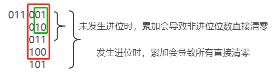

# 201-数字范围按位与-M

### 1.题目

给定范围 [m, n]，其中 0 <= m <= n <= 2147483647，返回此范围内所有数字的按位与（包含 m, n 两端点）。

举例1

```
输入: [5,7]
输出: 4
```

举例2

```
输入: [0,1]
输出: 0
```


### 2.解题思路

对于连续数字的二进制形式，每相邻2个数，其2^0处必然不同。再者，若不断累加，必然会导致进位，那么此时包含进位及其以下的进制位将被清零。由此可以来给出算法依据，不断右移直接判断高位的进制值是否相同，即可得到按位与结果。




### 3.算法实现

```python
class Solution(object):
    def rangeBitwiseAnd(self, m, n):
        """
        :type m: int
        :type n: int
        :rtype: int
        """
        count = 0
        while m != n:
            m >>= 1
            n >>= 1
            count += 1
        return m << count
```

