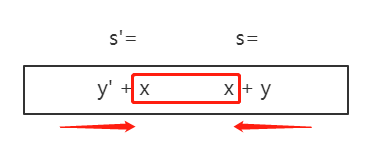

# 214-最短回文串-H

### 1.题目

给定一个字符串 ***s***，你可以通过在字符串前面添加字符将其转换为回文串。找到并返回可以用这种方式转换的最短回文串。

举例1

```
输入: "aacecaaa"
输出: "aaacecaaa"
```

举例2

```
输入: "abcd"
输出: "dcbabcd"
```


### 2.解题思路

注意题目提到是在字符串前面添加字符，由此整体来说题目需要考虑的方面减少了很多。根据题目意思，求所需的最短字符串，其实是在找**从头部开始找最长的回文子串**，找到后在头部前面拼接上逆序的剩余子串即可。

`s=x+y` 其中x是最长子串，y是剩余子串。我们可以得到整体的逆序字符串`s'=y'+x`，那么拼接起来可得

`s'+s=y'+x+x+y`。

此时可以明白算法的本质是s的逆序字符串，从首部向尾部递减截取；s字符串，从尾部向首部递减截取，判断截取出来的字符串是否相等，若相等则为最长回文子串。




### 3.算法实现

```python
class Solution(object):
    def shortestPalindrome(self, s):
        """
        :type s: str
        :rtype: str
        """
        length=len(s)
        if length==0:
            return ""
        rs = s[::-1]
        i = 0
        while True:
            if rs[i:]==s[:length-i]:
                break
            i+=1
        return rs[:i]+s
```

