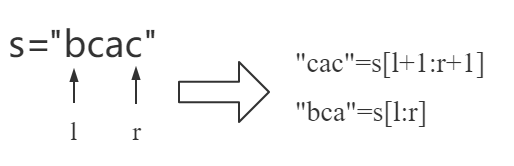

# 680-验证回文字符串-E

### 1.题目

给定一个非空字符串 `s`，**最多**删除一个字符。判断是否能成为回文字符串。

举例1

```
输入: "aba"
输出: True
```

举例2

```
输入: "abca"
输出: True
解释: 你可以删除c字符。
```

注意：

> 字符串只包含从 a-z 的小写字母。字符串的最大长度是50000。


### 2.解题思路

依题目要求，至多可以删除一个字符来判断回文，首先判断不删除字符情况下，该字符串是否为回文。若不满足回文，接下来有两种思路：1）利用循环逐个删除1个字符，判断剩下的字符串是否为回文。2）利用双指针方式从首尾向中间判断。

思路1简单，但对长字符串进行循环时间复杂度较高，不推荐。思路2能够较好满足各场景需求。

使用`"dbcacd"`字符串思路2举例，通过首尾校验向中间判断，即判断`"bcac"`在删除1个字符的情况下，能否成为回文字符串。



即判断右边两个字符串是否为回文即可。

### 3.算法实现

```python
class Solution(object):
    def validPalindrome(self, s):
        """
        :type s: str
        :rtype: bool
        """
        if s == s[::-1]: return True
        l, r = 0, len(s)-1
        while True:
            if s[l] == s[r]:
                l += 1
                r -= 1
            else:
                s1 = s[l+1:r+1]
                s2 = s[l:r]
                return s1==s1[::-1] or s2==s2[::-1]
```

