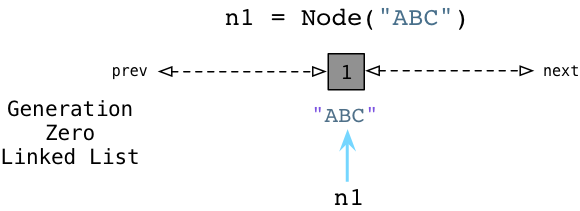
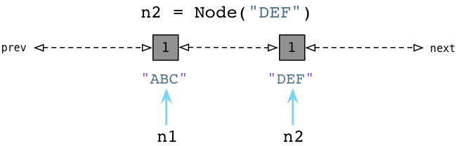
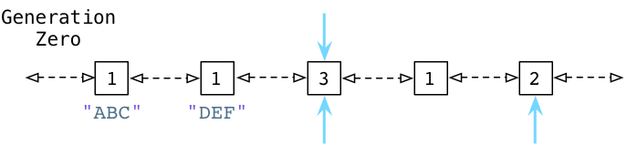
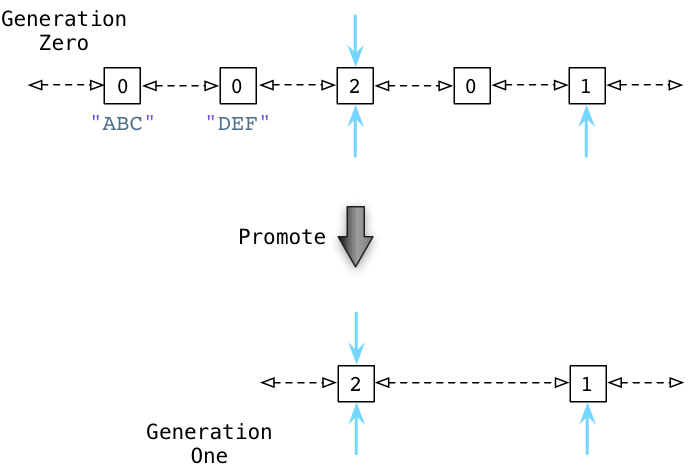

#Python中的GC

##前言

如果把运行的应用比作一个人的身体，那么代码逻辑、算法可以比作人的大脑。对于垃圾回收机制可以认为是跳动的心脏，就像心脏给人传送这血液和营养，垃圾回收机制给应用提供内存和对象。


## 1.解释器分配内存

在程序中创建对象时，Python解释器**会立即向操作系统请求分配内存空间**。这一点其实是相对于另一种分配内存对象的方式而言，即`Free List`。`Free List`会在程序开始运行之前，提前分配好数以千计的内存空间。

与此同时，Python会在每个对象内部维护一个`reference count`，每当有一个指针(可以是变量)指向这个对象时，引用计数会增加1。

### 1.1几种特殊情况

#### a)小整数对象池

Python为了优化垃圾回收机制，为小整数建立了小整数对象池，避免其频繁地申请和销毁内存空间。Python对于小整数的定义是`[-5,257]`，这部分的整数对象是提前建立好的，不会被垃圾回收。对于小整数以外的对象，在程序运行过程中会创建一个新的对象。

#### b)Intern机制

对于多个相同的字符串，Python解释器不会创建多个对象，其只会占用一个字符串所占的空间，靠引用计数去维护何时释放。这一点依赖于字符串对象的不可修改性。


## 2.GC机制

Python程序的垃圾回收机制有引用计数、标记-清除、分代回收三种。以引用计数回收为主，标记-清除和分代回收为辅。

### 2.1引用计数回收

在程序运行过程中，一旦某个对象的引用计数变成0，那么Python解释器将立即触发引用计数回收，释放该对象所占用的内存。

#### 引用计数的优点

a)简单。

b)实时性。

#### 引用计数回收的缺点

a)引用计数需要花费每个对象一定的内存空间。

b)引用计数的改变可能涉及复杂的底层操作，例如某个对象计数器增1，另一个对象计数器减1，释放大的数据结构会涉及更加复杂的操作。

c)无法处理循环引用场景的释放内存问题。

#### 引用计数增加情况

a)对象创建以及被引用。

b)对象作为参数传递到函数中。

c)对象作为元素存储在容器中。

#### 引用计数减少情况

a)对象被显示销毁。

b)对象被另一个变量锁引用。

c)对象离开作用域。

### 2.2标记-清除与分代回收

为了解决循环引用场景带了的问题，Python还引入了标记-清除与分代回收机制。在Python内部会维护不同的链表来追踪活跃对象，例如零代`Generation Zero`、一代、二代等。

**Pic:创建对象n1**



**Pic:创建对象n2**



**Pic:循环引用并清理变量**



每当创建一个对象的时候，Python解释器会自动将其加入到零代链表。在程序运行过程中，非循环引用的垃圾对象会被实时清理，而在零代链表中，暂时都会被保留。在运行时的某一刻，被分配的计数值与被释放对象的计数值达到阈值，Python解释器会自动触发检测循环引用。

**Pic:检测与清理循环引用**



解释器会循环遍历列表上的每个对象，根据规则减去相互引用的计数。随后判断每个对象的引用计数，将计数值不为0的对象转移到下一代(对于零代的下一代就是1代)，并将零代上的剩余对象回收。从1代到2代的分代回收同样类似，只是触发的阈值会更高一些，这是基于弱代假说。

> 弱代假说：新生成的对象往往只是暂时存在的，随着程序的运行通常会被抛弃。而自转移到1代之后开始，对象可以被认为是较长期会被使用的，清理的频率较低。

### 2.3触发回收的情况

a)调用`gc.collect()`。

b)当gc模块的计数器差值达到阈值。

c)程序退出。

### 2.4注意事项

#### a)类重写del方法GC不生效

定义的类中若我们自己重写了`__del__()`方法，那么将影响GC回收机制。因此需要避免重新该方法。

#### b)查看对象的引用计数

```python
import sys

print(sys.getrefcount(obj))
```

